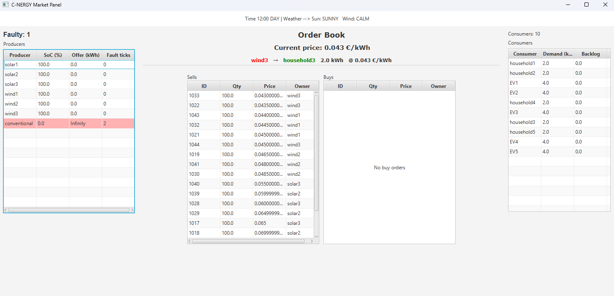

# C-NERGY: Multi-Agent system for Decentralized Energy Market Simulation

# **Abstract**

This project presents a decentralized multi-agent system for simulating and optimizing energy distribution and pricing in a dynamic market environment. Built using the JADE framework, the system models renewable (solar, wind) and conventional energy producers, consumers with time-varying demand, and a central broker agent that clears a double-auction market. Producers dynamically adjust energy generation based on weather patterns and battery capacity while optimizing pricing through adaptive margins, whereas consumers modulate demand according to load profiles and bid strategically in response to market fluctuations. Real-time weather data, fault injections, and GUI monitoring enable a realistic simulation of grid resilience and market volatility. The broker agent employs price-time priority matching to determine market-clearing prices, fostering competition and efficiency. Key innovations include adaptive learning mechanisms for pricing strategies, fault-tolerant coordination, and a modular design extensible to machine learning forecasting or trader agents. This system serves as a testbed for exploring decentralized energy market dynamics, renewable integration challenges, and AI-driven optimization strategies in smart grid ecosystems.

# System Implementation

## WeatherAgent

The Weather agent simulates dynamic weather conditions and time-of-day cycles to influence renewable energy production. It provides weather updates to renewable energy producers (`SolarAgent`, `WindAgent`).

---

### **Responsibilities**

- Generate probabilistic weather state tokens (`SUNNY/CLOUDY`, `WINDY/CALM`) and time-of-day tokens (`DAY/NIGHT`).
- Broadcast weather updates Solar/Wind agents at fixed intervals.

---

### **Message Protocols**

| Protocol | Ontology | Direction | Description |
| --- | --- | --- | --- |
| `INFORM` | `WEATHER` | OUT | Broadcast weather and time conditions. |
- **`INFORM` Content:**
    - **`SUN`**: **`SUNNY`** or **`CLOUDY`** (affects solar panel efficiency).
    - **`WIND`**: **`WINDY`** or **`CALM`** (impacts wind turbine output).
    - **`TIME`**: **`DAY`** or **`NIGHT`** (determines solar availability).
    - **`hour`**: Current simulated hour (0–23).

---

### **Configuration Parameters**

| **Parameter** | **Description** | **Default** |
| --- | --- | --- |
| **`period`** | Update interval (seconds) | **`3`** |
| **`solarProb`** | Probability of **`SUNNY`** weather | **`0.5`** |
| **`windProb`** | Probability of **`WINDY`** conditions | **`0.5`** |
| **`DebuggingMode`** | Log weather updates to console | **`true`** |

```java
// Example Initialization:
Object[] args = {3, 0.7, 0.3, true}; // Period=3s, 70% sunny, 30% windy, debug on
addAgent(WeatherAgent.class.getName(), args);
```

---

### **Behaviours**

1. `TickerBehaviour`:
    - Triggers weather updates every `period` ticks.
    - Simulates time progression.
    - Generates probabilistic weather tokens using `Random`.

```java
// Inside TickerBehaviour
String timeToken = (hour >= 7 && hour <= 21) ? "DAY" : "NIGHT";
String solarToken = rand.nextDouble() < solarProb ? "SUNNY" : "CLOUDY";
String windToken = rand.nextDouble() < windProb ? "WINDY" : "CALM";
```

---

### **Interactions**

- **Sends To:**
    - `SolarAgent`/`WindAgent`: Weather updates to adjust energy production (e.g. solar panels inactive at night).
    - `GUI Agent`: Sends information on the Dashboard.
- **Receives From:**
    
    None (acts as a broadcast-only agent).
    

---

## SolarAgent

The SolarAgent simulates a solar panel plant that generates electricity based on weather and time conditions, participates in the energy market and manages battery storage.

---

### **Responsibilities**

- Adjust energy production based on weather tokens (`SUNNY`/`CLOUDY`) and time-of-day tokens (`DAY`/`NIGHT`).
- Submit **sell orders** to the `BrokerAgent` with dynamic pricing.
- Store excess energy in batteries and manage production based on state-of-charge, so that no excess energy is wasted.
- Adapt pricing strategy using market feedback (accepted/rejected orders).
- Handle faults (e.g. temporary shutdowns).

---

### **Message Protocols**

| **Protocol** | **Ontology** | **Direction** | **Description** |
| --- | --- | --- | --- |
| **`INFORM`** | **`WEATHER`** | IN | Weather/time updates from **`WeatherAgent`**. |
| **`INFORM`** | **`PRICE_TICK`** | IN | Last market-clearing price from **`BrokerAgent`**. |
| **`INFORM`** | **`FAULT`** | IN | Fault notifications from **`FaultAgent`**. |
| **`PROPOSE`** | **`ORDER`** | OUT | Send sell orders to **`BrokerAgent`.** |
| **`INFORM`** | **`PRODUCER_STATUS`** | OUT | Status updates to **`GUI Agent`** (**`soc`**, **`prod`**, **`fault`**). |

---

### **Configuration Parameters**

| **Parameter** | **Description** | **Default** |
| --- | --- | --- |
| **`capacity`** | Max solar panel output (kW) | **`50.0`** |
| **`hasBattery`** | Enable battery storage | **`true`** |
| **`battCapacity`** | Battery capacity (kWh) | **`100.0`** |
| **`coeffSunny`** | Output multiplier for sunny weather | **`1.0`** |
| **`coeffCloudy`** | Output multiplier for cloudy weather | **`0.4`** |
| **`baseCost`** | Base operational cost (€/kWh) | **`0.035`** |
| **`margin`** | Initial profit margin (€/kWh) | **`0.005`** |
| **`alpha`** | Learning rate for margin adjustments | **`0.003`** |
| `DebuggingMode` | Enables debugging mode. | `false` |

```java
// Example Initialization:
Object[] args = {50.0, true, 100.0, 1.0, 0.4, 0.035, 0.005, 0.03, true};
// capacity, hasBattery, battCapacity, coeffSunny, coeffCloudy, baseCost, margin, alpha, debug
```

---

### **Behaviours**

1. `CyclicBehaviour`:
    - Handles incoming messages:
    
    ```java
    switch (msg.getPerformative()) {
        case ACLMessage.INFORM: onInform(msg); // Weather/price/fault updates
        case ACLMessage.ACCEPT_PROPOSAL: onFill(msg, true); // Order accepted
        case ACLMessage.REJECT_PROPOSAL: onReject(msg); // Order rejected
    }
    ```
    
2. `TickerBehaviour` (Hourly cycle):
    - Fault handling:
    
    ```java
    if (isFaulty) {
        faultDuration -= 1; // Countdown to recovery
    }
    ```
    
    - Enegy production:
    
    ```java
    if (timeToken.equals("DAY")) {
        double factor = "SUNNY".equals(solarToken) ? coeffSunny : coeffCloudy;
        production = capacity * factor;
    }
    ```
    
    - Order submission:
    
    ```java
    double price = baseCost + margin;
    order.setContent("qty="+available+";price="+price+";side=sell");
    ```
    

---

### **Internal Logic**

- Adaptive production based on battery levels:

```java
// Production
production = capacity * factor;
production = Math.min(production, battCapacity - soc);

// Available energy to send
double available = production + soc;
```

- Margin adjustment (Dynamic pricing):

```java
// On acceptance
margin += alpha; // Increase margin
margin = Math.min(margin, 0.1);

// On rejection
margin -= alpha; // Decrease margin
margin = Math.max(-0.02, margin);
```

---

### **Interactions**

- Receives from:
    - **`WeatherAgent`**: Weather/time updates (**`SUNNY`**, **`DAY`**).
    - **`BrokerAgent`**: Order acceptance/rejection.
    - **`FaultAgent`**: Fault triggers (**`FAULT`** ontology).
- Sends to:
    - **`BrokerAgent`**: Sell orders (**`PROPOSE`**).
    - **`GUI Agent`**: Status updates (**`soc`**, **`prod`**).

---

## **WindAgent**

The **WindAgent** simulates a wind turbines plant producer that generates electricity based on wind conditions, participates in the energy market, and manages battery storage.

---

### Responsibilities

- Adjust energy production based on **wind conditions** (`WINDY`/`CALM`).
- Submit **sell orders** to the `BrokerAgent` with dynamic pricing.
- Store excess energy in batteries and manage production based on state-of-charge (`soc`).
- Adapt pricing strategy using market feedback (accepted/rejected orders).
- Handle faults (e.g., temporary shutdowns).

---

### **Message Protocols**

| **Protocol** | **Ontology** | **Direction** | **Description** |
| --- | --- | --- | --- |
| **`INFORM`** | **`WEATHER`** | IN | Wind condition updates from **`WeatherAgent`**. |
| **`INFORM`** | **`PRICE_TICK`** | IN | Last market-clearing price from **`BrokerAgent`**. |
| **`INFORM`** | **`FAULT`** | IN | Fault notifications from **`FaultAgent`**. |
| **`PROPOSE`** | **`ORDER`** | OUT | Sell orders to **`BrokerAgent`**. |
| **`INFORM`** | **`PRODUCER_STATUS`** | OUT | Status updates to **`GUI Agent`** (`soc`, `prod`, `fault`). |

---

### **Configuration Parameters**

| **Parameter** | **Description** | **Default** |
| --- | --- | --- |
| **`capacity`** | Max wind turbine output (kW) | **`50.0`** |
| **`hasBattery`** | Enable battery storage | **`true`** |
| **`battCapacity`** | Battery capacity (kWh) | **`100.0`** |
| **`coeffWindy`** | Output multiplier for windy conditions | **`1.0`** |
| **`coeffCalm`** | Output multiplier for calm conditions | **`0.2`** |
| **`baseCost`** | Base operational cost (€/kWh) | **`0.035`** |
| **`margin`** | Initial profit margin (€/kWh) | **`0.005`** |
| **`alpha`** | Learning rate for margin adjustments | **`0.003`** |
| **`DebuggingMode`** | Enables debugging logs | `false` |

**Example Initialization**:

```java
Object[] args = {50.0, true, 100.0, 1.0, 0.2, 0.035, 0.005, 0.03, true};
// capacity, hasBattery, battCapacity, coeffWindy, coeffCalm, baseCost, margin, alpha, debug
```

---

### **Behaviours**

1. **`CyclicBehaviour`**:
    - Handles incoming messages:
        
        ```java
        switch (msg.getPerformative()) {
            case ACLMessage.INFORM: onInform(msg); // Weather/price/fault updates
            case ACLMessage.ACCEPT_PROPOSAL: onFill(msg, true); // Order accepted
            case ACLMessage.REJECT_PROPOSAL: onReject(msg); // Order rejected
        }
        ```
        
2. **`TickerBehaviour` (Hourly Cycle)**:
    - Fault Handling:
        
        ```java
        if (isFaulty) {
            faultDuration -= 1; // Countdown to recovery
        }
        ```
        
    - Energy Production:
        
        ```java
        double factor = "WINDY".equals(windToken) ? coeffWindy : coeffCalm;
        production = capacity * factor;
        ```
        
    - Order Submission:
        
        ```java
        double price = baseCost + margin;
        price = Math.max(price, lastClearingPrice - 0.02); // Avoid undercutting
        ```
        

---

### **Internal Logic**

- Adaptive Production based on battery levels:
    
    ```java
    production = Math.min(production, battCapacity - soc); // Prevent overcharging
    double available = production + soc; // Total energy for sale
    
    ```
    
- Margin Adjustment:
    
    ```java
    // On acceptance (smaller adjustment than SolarAgent)
    margin += alpha * 0.1;
    margin = Math.min(margin, 0.1);
    
    // On rejection
    margin -= alpha * 0.1;
    margin = Math.max(-0.02, margin);
    
    ```
    

---

### **Interactions**

- Receives from:
    - **`WeatherAgent`**: Wind condition updates (`WINDY`, `CALM`).
    - **`BrokerAgent`**: Order acceptance/rejection.
    - **`FaultAgent`**: Fault triggers (`FAULT` ontology).
- Sends to:
    - **`BrokerAgent`**: Sell orders (`PROPOSE`).
    - **`GUI Agent`**: Status updates (`soc`, `prod`).

---

## ConventionalAgent

The **ConventionalAgent** simulates a traditional power plant (e.g., fossil fuel) that provides backup energy supply with fixed pricing and unlimited capacity.

---

### **Responsibilities**

- Act as a **backup energy supplier** with infinite capacity to ensure grid stability.
- Submit sell orders to the **`BrokerAgent`** at a fixed margin above the last market price.
- Handle faults (temporary shutdowns).

---

### **Message Protocols**

| **Protocol** | **Ontology** | **Direction** | **Description** |
| --- | --- | --- | --- |
| **`INFORM`** | **`PRICE_TICK`** | IN | Last market-clearing price from **`BrokerAgent`**. |
| **`INFORM`** | **`FAULT`** | IN | Fault notifications from **`FaultAgent`**. |
| **`PROPOSE`** | **`ORDER`** | OUT | Sell orders to **`BrokerAgent`** (**`qty=∞`**, **`price`**). |
| **`INFORM`** | **`PRODUCER_STATUS`** | OUT | Status updates to **`GUI Agent`** (**`prod=∞`**, **`fault`**). |

---

### **Configuration Parameters**

| **Parameter** | **Description** | **Default** |
| --- | --- | --- |
| **`margin`** | Fixed profit margin (€/kWh) | **`0.05`** |
| **`DebuggingMode`** | Enables debugging logs | **`false`** |

```java
// Example Initialization
Object[] args = {0.05, true}; // margin=0.05, debug=true
addAgent(ConventionalAgent.class.getName(), args);
```

---

### **Behaviours**

1. **`CyclicBehaviour`**:
    - Handles incoming messages:

```java
case ACLMessage.ACCEPT_PROPOSAL: onFill(msg); // Order accepted
case ACLMessage.INFORM: onInform(msg); // Price/fault updates
```

1. **`TickerBehaviour` (Hourly Cycle)**:
    - Fault Handling:
    
    ```java
    if (isFaulty) {
        faultDuration -= 1; // Countdown to recovery
    }
    ```
    
    - Order Submission:
    
    ```java
    double price = lastPrice + margin;
    order.setContent("qty="+Double.POSITIVE_INFINITY+";price="+price+";side=sell");
    ```
    

---

### **Internal Logic**

- Price Calculation:

```java
double price = lastPrice + margin; // Fixed margin above last market price
```

- Infinite Supply:

```java
order.setContent("qty="+Double.POSITIVE_INFINITY+";..."); // Unlimited energy
```

---

### **Interactions**

- Receives From:
    - **`BrokerAgent`**: Price updates (**`PRICE_TICK`**).
    - **`FaultAgent`**: Fault triggers (**`FAULT`**).
- Sends To:
    - **`BrokerAgent`**: Infinite sell orders (**`PROPOSE`**).
    - **`GUI Agent`**: Status updates (**`prod=∞`**).

---

## BokerAgent

The **BrokerAgent** acts as the central energy market operator, matching buy/sell orders and determining the market-clearing price.

---

### **Responsibilities**

- Maintain an **order book** of buy/sell orders from producers and consumers.
- Match orders using a **price-time priority** algorithm.
- Broadcast the latest market price to all agents.
- Expire unmatched orders after a fixed duration.

---

### **Message Protocols**

| **Protocol** | **Ontology** | **Direction** | **Description** |
| --- | --- | --- | --- |
| **`PROPOSE`** | **`ORDER`** | IN | Receive buy/sell orders from producers/consumers. |
| **`ACCEPT_PROPOSAL`** | **`ORDER`** | OUT | Notify parties of matched orders. |
| **`REJECT_PROPOSAL`** | **`ORDER`** | OUT | Notify expired/cancelled orders. |
| **`INFORM`** | **`PRICE_TICK`** | OUT | Broadcast latest market price to all agents. |
| **`INFORM`** | **`TRADE_LOG`** | OUT | Send trade details to GUI Agent. |

---

### **Configuration Parameters**

| **Parameter** | **Description** | **Default** |
| --- | --- | --- |
| `expiryTicks` | Orders expiration duration | `3` |
| **`DebuggingMode`** | Enables order/trade logging | **`true`** |

```java
// Example initialization
Object[] args = {3, true}; // DebuggingMode=true
addAgent(BrokerAgent.class.getName(), args);
```

---

### **Behaviours**

1. **`CyclicBehaviour`**:
    - Receives and processes incoming orders:
    
    ```java
    if (msg.getPerformative() == ACLMessage.PROPOSE) {
        addOrder(msg); // Add to order book
        match(); // Attempt to match orders
    }
    ```
    
2. **`TickerBehaviour`**:
    - Expires orders:
    
    ```java
    expireOrder(); // Remove stale orders
    ```
    

---

### **Internal Logic**

- Order Matching:

```java
while (bids.peek().price >= asks.peek().price) {
    double qty = Math.min(buy.qty, sell.qty);
    lastPrice = sell.price; // Price-taker model
}
```

- Order Prioritization:
    - **Buyers**: Highest price first (buyers compete).
    - Sellers: Lowest price first (sellers compete).

```java
private final PriorityQueue<Order> bids = new PriorityQueue<>((a,b) -> 
    Double.compare(b.price, a.price)); // Buyers: highest price first
private final PriorityQueue<Order> asks = new PriorityQueue<>((a,b) -> 
    Double.compare(a.price, b.price)); // Sellers: lowest price first
```

---

### **Interactions**

- Receives from:
    - **Producers** (**`SolarAgent`**, **`WindAgent`**, **`ConventionalAgent`**): Sell orders.
    - **Consumer Agents**: Buy orders.
- Sends to:
    - **All Agents**: Market price updates (**`PRICE_TICK`**).
    - **GUI Agent**: Real-time order/trade data.

---

## ConsumerAgent

The **ConsumerAgent** simulates an energy consumer that participates as a buyer in the market, submitting buy orders based on a predefined demand profile and using dynamic pricing straytegy.

---

### **Responsibilities**

- Calculate hourly energy demand using a **24-hour load profile**.
- Submit buy orders to the **`BrokerAgent`** with dynamic pricing.
- Adjust pricing strategy based on market feedback (accepted/rejected orders).
- Keep a backlog with unmet demand, adding it to the next order.

---

### **Message Protocols**

| **Protocol** | **Ontology** | **Direction** | **Description** |
| --- | --- | --- | --- |
| **`PROPOSE`** | **`ORDER`** | OUT | Buy orders to **`BrokerAgent`** (**`qty`**, **`price`**, **`side=buy`**). |
| **`ACCEPT_PROPOSAL`** | **`ORDER`** | IN | Order fulfillment confirmation from **`BrokerAgent`**. |
| **`REJECT_PROPOSAL`** | **`ORDER`** | IN | Order rejection from **`BrokerAgent`**. |
| **`INFORM`** | **`CONSUMER_STATUS`** | OUT | Status updates to **`GUI Agent`** (**`demand`**, **`backlog`**). |

---

### **Configuration Parameters**

| **Parameter** | **Description** | **Default** |
| --- | --- | --- |
| **`margin`** | Initial profit margin (€/kWh) | **`0.005`** |
| **`alpha`** | Learning rate for margin adjustments | **`0.003`** |
| **`utilityCap`** | Maximum willingness to pay (€/kWh) | **`0.12`** |
| **`hourlyLoad`** | 24-hour demand profile (kW) | **`[1,1,...,1]`** |
| **`multFactor`** | Scaling factor for demand | **`1.0`** |
| **`DebuggingMode`** | Enables logging | **`false`** |

```java
// Example initialization
double[] loadProfile = {1,1,1,1,1,1,2,3,3,2,2,2,2,2,2,2,3,5,5,4,3,2,1,1};
Object[] args = {0.005, 0.005, 0.12, loadProfile, 1.0, true};
// margin, alpha, utilityCap, hourlyLoad, multFactor, debug
```

---

### **Behaviours**

1. **`CyclicBehaviour`**:
    - Handles order responses:
    
    ```java
    case ACLMessage.ACCEPT_PROPOSAL: onFill(msg, false); // Order filled
    case ACLMessage.REJECT_PROPOSAL: onReject(msg); // Order rejected
    ```
    
2. **`TickerBehaviour` (Hourly Cycle)**:
    - Demand Calculation:
    
    ```java
    hour = tick % 24;
    demand = hourlyLoad[hour] * multFactor + backlog;
    ```
    
    - Order Submission:
    
    ```java
    double price = utilityCap - margin; // Max price minus margin
    order.setContent("qty="+openQty+";price="+price+";side=buy");
    ```
    

---

### **Internal Logic**

- Backlog Management:

```java
backlog = Math.max(0, backlog - qty); // On order fill
backlog = openQty; // On rejection
```

- Dynamic Pricing:

```java
// On acceptance (decrease prices)
margin += alpha; 
margin = Math.max(0.005, margin);

// On rejection (increase prices)
margin -= alpha;
margin = Math.min(0.001, margin);
```

---

### **Interactions**

- Receives from:
    - **`BrokerAgent`**: Order acceptance/rejection.
- Sends to:
    - **`BrokerAgent`**: Buy orders.
    - **`GUI Agent`**: Demand and backlog updates.

---

## FaultAgent

The **FaultAgent** simulates random faults in energy producers to test system resilience and market dynamics under disruptions.

---

### **Responsibilities**

- Periodically inject faults into randomly selected producers (**`SolarAgent`**, **`WindAgent`**, etc.).
- Notify the **`GUI Agent`** of faults for visualization.
- Dynamically discover target agents via JADE’s Directory Facilitator (DF).

---

### **Message Protocols**

| **Protocol** | **Ontology** | **Direction** | **Description** |
| --- | --- | --- | --- |
| **`INFORM`** | **`FAULT`** | OUT | Fault trigger to producers (**`outage=duration`**). |
| **`INFORM`** | **`FAULT`** | OUT | Fault details to **`GUI Agent`** (**`victim`**, **`outage`**). |

---

### **Configuration Parameters**

| **Parameter** | **Description** | **Default** |
| --- | --- | --- |
| **`periodFault`** | Interval (seconds) between fault injections | **`20`** |
| **`targets`** | Agent types to target (e.g., **`"solar-producer"`**) | **`["solar-producer", "wind-producer", ...]`** |
| **`faultDuration`** | Duration of outages (seconds) | **`5`** |
| **`DebuggingMode`** | Enables fault injection logs | **`false`** |

```java
// Example initialization
String[] targets = {"solar-producer", "conventional-producer"};
Object[] args = {20, targets, 5, true}; 
// periodFault=20s, targets, faultDuration=5s, debug=true
```

---

### **Behaviours**

1. **`TickerBehaviour`**:
    - Triggers fault injection every **`periodFault`** seconds:
    
    ```java
    List<AID> producers = search(target); // Find agents of target type
    AID victim = producers.get(rand.nextInt(producers.size())); // Random selection
    ```
    
    - Sends fault notifications to the victim and GUI:
    
    ```java
    msg.setContent("outage="+faultDuration); // Fault duration
    g.setContent("outage="+faultDuration+";victim="+victim.getLocalName());
    ```
    

---

### **Internal Logic**

- Dynamic Discovery:

```java
List<AID> search(String type) {
    // Uses DFService to find agents by type (e.g., "solar-producer")
}
```

- Random Targeting:

```java
AID victim = producers.get(rand.nextInt(producers.size())); // Random victim
```

---

### **Interactions**

- Sends to:
    - **Producers** (**`SolarAgent`**, **`WindAgent`**, etc.): Fault triggers (**`FAULT`** ontology).
    - **`GUI Agent`**: Fault details for visualization.
- Receives from: 
None (acts as a trigger-only agent).

---

# Examples

---

### Balanced dynamics:

- **Producers: 6** → 3 SolarAgents & 3 WindAgents

```java
    int N_SOLAR = 3;
    int N_WIND = 3;
    
    for (int i = 1; i <= N_SOLAR; i++) {
        cc.createNewAgent("solar"+i, "cnergy.agents.SolarAgent",
                new Object[]{25, true, 100.0, 1.0, 0.4, 0.035, 0.005, 0.005, true})
          .start();
    }

    for (int i = 1; i <= N_WIND; i++) {
        cc.createNewAgent("wind"+i, "cnergy.agents.WindAgent",
                new Object[]{25, true, 100.0, 1.0, 0.2, 0.035, 0.005, 0.005, true})
          .start();
    }
```

- **Consumers: 10** → 5 Households & 5 EVs (Electric Vehicles)

```java
    int N_CONSUMERS_1 = 5;
		int N_CONSUMERS_2 = 5;
    
    double [] homeLoad = new double[] {1,1,1,1,1,1, 2,3,3,2,2,2, 2,2,2,2,3,5, 5,4,3,2,1,1};
    multFactor = 1;
    for (int i = 1; i <= N_CONSUMERS_1; i++) {
        cc.createNewAgent("household"+i, "cnergy.agents.ConsumerAgent",
                new Object[]{0.005, 0.005, 0.14, homeLoad, multFactor, true})
          .start();
    }

    double[] evLoad = new double[]{0,0,0,0,0,0,  0,0,0,0,0,0, 0,0,0,0,8, 8,8,7,7,6,5,4};
    multFactor = 1;
    for (int i = 1; i <= N_CONSUMERS_2; i++) {
        cc.createNewAgent("EV"+i, "cnergy.agents.ConsumerAgent",
                new Object[]{0.005, 0.005, 0.12, evLoad, multFactor, true})
          .start();
    }
```



---

### Overwhelming Demand:

- **Producers: 6** → 3 SolarAgents & 3 WindAgents

```java
    int N_SOLAR = 3;
    int N_WIND = 3;
    
    for (int i = 1; i <= N_SOLAR; i++) {
        cc.createNewAgent("solar"+i, "cnergy.agents.SolarAgent",
                new Object[]{25, true, 100.0, 1.0, 0.4, 0.035, 0.005, 0.005, true})
          .start();
    }

    for (int i = 1; i <= N_WIND; i++) {
        cc.createNewAgent("wind"+i, "cnergy.agents.WindAgent",
                new Object[]{25, true, 100.0, 1.0, 0.2, 0.035, 0.005, 0.005, true})
          .start();
    }
```

- **Consumers: 30** → 25 Households & 5 EVs (Electric Vehicles)

```java
    int N_CONSUMERS_1 = 5;
		int N_CONSUMERS_2 = 5;
    
    double [] homeLoad = new double[] {1,1,1,1,1,1, 2,3,3,2,2,2, 2,2,2,2,3,5, 5,4,3,2,1,1};
    multFactor = 1;
    for (int i = 1; i <= N_CONSUMERS_1; i++) {
        cc.createNewAgent("household"+i, "cnergy.agents.ConsumerAgent",
                new Object[]{0.005, 0.005, 0.14, homeLoad, multFactor, true})
          .start();
    }

    double[] evLoad = new double[]{0,0,0,0,0,0,  0,0,0,0,0,0, 0,0,0,0,8, 8,8,7,7,6,5,4};
    multFactor = 1;
    for (int i = 1; i <= N_CONSUMERS_2; i++) {
        cc.createNewAgent("EV"+i, "cnergy.agents.ConsumerAgent",
                new Object[]{0.005, 0.005, 0.12, evLoad, multFactor, true})
          .start();
    }
```


---

### Overwhelming Supply:

- **Producers: 6** → 3 SolarAgents & 3 WindAgents

```java
    int N_SOLAR = 3;
    int N_WIND = 3;
    
    for (int i = 1; i <= N_SOLAR; i++) {
        cc.createNewAgent("solar"+i, "cnergy.agents.SolarAgent",
                new Object[]{25, true, 100.0, 1.0, 0.4, 0.035, 0.005, 0.005, true})
          .start();
    }

    for (int i = 1; i <= N_WIND; i++) {
        cc.createNewAgent("wind"+i, "cnergy.agents.WindAgent",
                new Object[]{25, true, 100.0, 1.0, 0.2, 0.035, 0.005, 0.005, true})
          .start();
    }
```

- **Consumers: 2** → 2 Households & 0 EVs (Electric Vehicles)

```java
    int N_CONSUMERS_1 = 5;
		int N_CONSUMERS_2 = 5;
    
    double [] homeLoad = new double[] {1,1,1,1,1,1, 2,3,3,2,2,2, 2,2,2,2,3,5, 5,4,3,2,1,1};
    multFactor = 1;
    for (int i = 1; i <= N_CONSUMERS_1; i++) {
        cc.createNewAgent("household"+i, "cnergy.agents.ConsumerAgent",
                new Object[]{0.005, 0.005, 0.14, homeLoad, multFactor, true})
          .start();
    }

    double[] evLoad = new double[]{0,0,0,0,0,0,  0,0,0,0,0,0, 0,0,0,0,8, 8,8,7,7,6,5,4};
    multFactor = 1;
    for (int i = 1; i <= N_CONSUMERS_2; i++) {
        cc.createNewAgent("EV"+i, "cnergy.agents.ConsumerAgent",
                new Object[]{0.005, 0.005, 0.12, evLoad, multFactor, true})
          .start();
    }
```


## Future ideas:

1. **Trader Agent**: ML/rule-based intermediary buying low and selling high for profit.
2. **Battery Degradation**: Battery capacity loss over charge/discharge cycles.
3. **Transmission Losses**: Simulate energy loss over grid distance.
4. **Equipment Wear:** Introduce maintenance costs and efficiency decay.
5. **Dynamic Fuel Pricing**: Update conventional energy costs via real-time fuel market APIs.
6. **Larger Load Profiles**: Enable weekly/monthly/yearly consumer demand profiles.
7. **Reinforcement Learning Pricing**: Train agents to optimize bids via reward systems.
8. **ML Forecasting**: Predict demand/price trends using time-series models.
